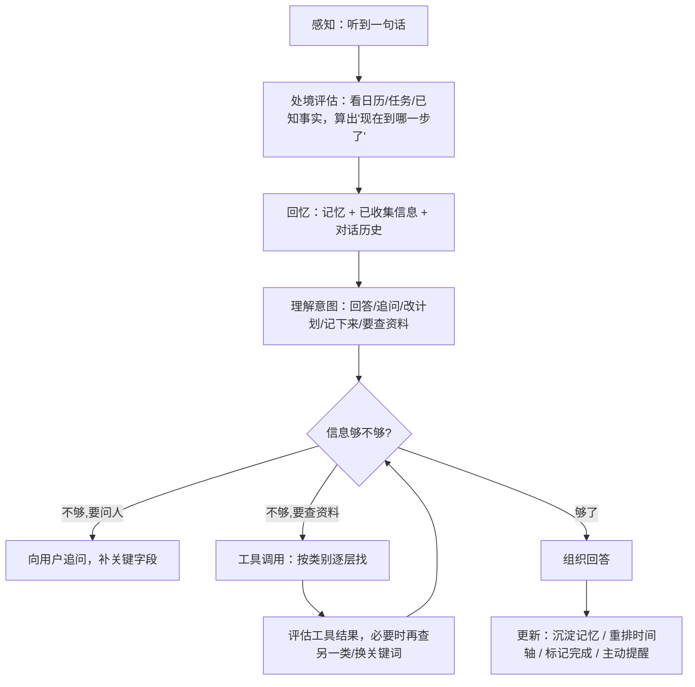
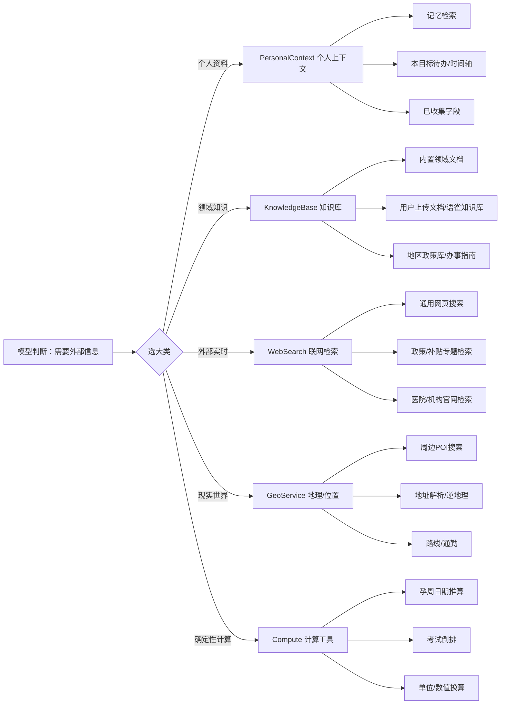

# 智能管家 —— Agent 认知架构与工具体系

> 核心原则：**把 agent 当成一个人来设计**。不管用户在聊考研、孕期还是考证，面对的是同一个人，只是他当前在办的事不同。
> 场景差异只改变“他知道什么、关心什么、手头有哪些资料/工具”，**不改变他思考与获取信息的方式**。
> 因此新增场景是“换一件他操心的事”，而不是“换一个脑子/写一套 if-else”。

## 一、统一认知循环（主流程只有一套）

所有对话都走同一个循环，场景只提供数据（字段、关注项、时间轴、常识、工具）：

要点：
- **判断“要不要查、查哪类、查不到要不要换一类”由模型决定**，后端不写 `if (message.contains("附近"))` 这类猜测。
- 代码只提供：当前处境、回忆、一组**分层组织的工具**、以及确定性的更新动作（时间轴重排、记忆写入）。
- 场景只声明：收集字段、关注项、属性目录、时间轴模板、处境算法、挂载哪些工具类别。

## 二、工具分层（避免一次性加载全部工具）

工具按“信息来源的可达成本/可信度”分层。模型先看到少数几个**大类**，按需展开某一类，再选择其中的小类或具体工具。
查资料遵循**先内后外、先确定后开放**的默认顺序：先查个人记忆/知识库，再查外部网络——就像人先翻自己的资料夹，找不到再上网。

### 分层加载机制
1. **第一层只暴露大类**（5 个左右）：每个大类是一个“元工具”，带名字、一句话说明、入参（通常就是“要查什么”）。
2. 模型选择某大类后，由该大类的 **ToolCategory 实现动态列出子工具**并执行；子工具不占第一层 token。
3. 大类内部可再有小类（如 WebSearch → 通用 / 政策 / 医院），由实现决定是直接执行还是二次选择。
4. 模型可**顺序尝试多个来源**：例如“产检补贴政策”→ 先查 `KnowledgeBase.地区政策库`，命中就用；没命中再 `WebSearch.政策专题`；再不够提示用户。结果要标注来源与时效。

### 工具大类约定
| 大类 | 职责 | 典型子工具 | 数据来源可靠性 |
|---|---|---|---|
| PersonalContext | 查“我自己的事” | 记忆检索、本目标时间轴/待办、已收集字段 | 最高（用户自己的数据） |
| KnowledgeBase | 查“已沉淀的知识” | 内置领域文档、用户上传文档、地区政策/办事指南 | 高（经过整理） |
| WebSearch | 查“开放网络上的最新信息” | 通用搜索、政策专题、机构官网 | 中（需标注来源、谨慎采信） |
| GeoService | 查“与位置相关的现实信息” | 周边 POI、逆地理、路线 | 中（地图服务） |
| Compute | 确定性计算，不让模型猜日期 | 孕周推算、考试倒排、单位换算 | 确定（代码算） |

### 调用约束（防止无限堆叠工具）
- **单轮工具调用预算**：一次回答内工具调用设上限（如 ≤5 次），超过则带着已拿到的结果作答并说明还没查到什么。
- **深度上限**：大类→子工具最多展开两层，不允许无限递归。
- **去重与短路**：同一查询命中高可信来源（PersonalContext/KnowledgeBase）就不再查 WebSearch，除非模型显式要求“上网核实最新”。
- **失败降级**：任一工具失败返回“查不到/服务不可用”，模型据此换一类或坦诚告知，不编造。
- **结果可追溯**：外部信息必须带来源，回答里标注“据 X，截至 Y”。

## 三、场景如何接入（新场景不改主流程）

一个场景 = 实现 `ScenarioDomain`，声明：
- `collectFields()`：创建前要问的字段；
- `focusAreas()`：内置关注项与依赖关系；
- `attributeCatalog()` / `attributeClasses()`：结构化记忆 schema；
- `plannedTasks()`：确定性时间轴模板；
- `situation(collected, focusAreas, today)`：**处境评估**（统一入口，算出当前阶段/关键日期/待办状态），替代分散的 `dynamicContext` + 日期归一化；
- `toolCategories()`：这件事挂载哪些工具大类（默认 PersonalContext + Compute 全开，其余按需开）。
- `researchBeforeCreate()` / `researchBrief()`：是否需要“先联网核实、让用户确认后再建目标”，以及调研要点（如考证要核实证书类型/发证机构、报名与考试时间、教材、官方入口）。默认不调研；这是“要不要查、查什么”的**声明**，具体怎么查仍由通用工具循环完成。

场景**不写**：意图识别分支、工具调用编排、是否联网的判断、记忆提炼 prompt——这些是“人”的通用能力。

### 示例：孕期场景的“查产检补贴”
1. 用户问：“北京产检有免费项目吗？”
2. 处境评估：孕 8 周、坐标北京朝阳、建档待办临近。
3. 模型判断需要外部信息，选 `KnowledgeBase` → 地区政策库；未命中。
4. 模型再选 `WebSearch` → 政策专题，拿到结果 + 来源。
5. 组织回答，标注“据北京医保局/卫健委，截至今天”，并提示以官方最新口径为准。
全程没有任何 `if pregnancy` 特判；考研场景若声明了 KnowledgeBase/WebSearch，问“考研报名政策”走的是完全相同的路径。

## 四、通用能力 vs 域定制边界

引擎与业务知识必须分离。加新场景是“换一件他操心的事”，不是重写脑子。

### 通用层（不感知具体场景，跨所有目标复用）
- **三层架构与认知循环**：perception（REST/SSE/DTO）、application（用例编排）、domain（模型与扩展点）、infrastructure（JPA/LLM/调度/外部服务）；上图“统一认知循环”只有一套。
- **对话与流式**：聊天管线、SSE 事件（chunk/reasoning/goal_created/done/error）、思考过程折叠与持久化、主/子对话权限隔离。
- **记忆系统**：2 小时增量提炼、中立记忆库 `user_memory`、多对多关联 `memory_session_rel`、结构化属性 Attribute（基类 + extras 扩展）。
- **时间轴与任务引擎**：`TimelineAppService.resync()` 按域返回的 `PlannedTask` 幂等创建/更新/删除、保留已完成、关键字段变更后重排；任务的提醒时间/分组/历史折叠逻辑通用。
- **确定性定时任务（不依赖 LLM）**：
  - `ReminderService`（固定间隔）：到提醒时间把待办推进到对应子对话；
  - `MemoryExtractionJob`（每 2 小时 cron）：增量记忆提炼与关联绑定。
- **工具体系**：`ToolCategory` 大类 + 子工具；大类自动合并子工具参数 schema 暴露给模型；按信息可靠性分流（结构化权威数据用工具、时效文本用联网/知识库）；工具已返回明确结果就以它为准，不被弱来源覆盖；思考摘要如实展示调用的工具、query 与参照地点 location。
- **空间查询的通用链路**：周边检索区分“以哪里为中心”——模型从提问中抽取参照地点放进 `location`（如“北京西站附近”），工具先正向地理编码出该点坐标再检索；未指定地点时才用用户当前定位。坐标永远来自地图服务或已授权定位，不让模型编经纬度。
- **持久化抽象**：仓储接口在 domain，实现可替换；换库只改 adapter。
- **建目标前调研**：`ChatAppService` 在主对话建目标分支按场景声明决定是否先调研；调研复用同一套工具循环，确认卡经 `goal_proposal` 事件推送，确认/修改/取消由模型判定，确认后复用 `createGoal`。调研期 `ToolContext.researchOnly=true`，联网只查不沉淀。

### 域定制层（每个 ScenarioDomain 自己定义）
- **时间锚点与处境摘要 `situation()`**：基于 collected 中的关键日期，确定性算出“现在处于什么阶段”注入系统提示。孕期=预产期→孕周；考研/考证=考试日→剩余天数与复习阶段。
- **时间轴模板 `plannedTasks()`**：该场景有哪些确定性节点、提前量、关注项归属。
- **收集字段 / 关注项 / 结构化属性 / 初始任务 / 字段归一化等业务规则**。

### 判断标准（防止 case-by-case 打补丁）
- 只对某个场景业务知识成立的（孕周公式、复习阶段阈值、产检节点）→ 放进该域的 `ScenarioDomain`。
- 对所有场景或“人如何获取信息”普遍成立的（先定位参照点再查周边、工具结果优先、按可靠性选来源、时间轴幂等重排）→ 放进通用层。
- 把具体场景关键词硬编码进工具路由（如把“妇产医院”写死）视为坏味道，应改为通用意图判断。

## 五、演进分期
- **一期**：引入 `AgentTool` / `ToolCategory` 抽象 + 单轮工具选择循环；把现有高德 POI 包成 `GeoService.周边POI`，由模型调用，替换 `nearbyKeyword` 关键词猜测。
- **二期**：把联网检索泛化为 `WebSearch`，知识库抽象为 `KnowledgeBase`（含内置文档与语雀），删除 `GoalAppService` 里的孕期特判；统一 `situation()`。
- **三期**：考研/考证补 `situation()` 与工具挂载，验证“换事不换脑”的通用性；加工具调用预算/去重/来源标注的统一中间件。

### 建目标前调研（通用流程，场景只声明开关）
有些目标（如考证）信息因具体选择差异很大，不能拿到名字就建。统一流程：
1. 主对话识别到建目标意图，若该场景 `researchBeforeCreate()` 为真，不追问硬编码字段、也不直接创建；
2. 通用工具循环带上该场景的 `researchBrief()`，让模型自行调用知识源（先知识库后联网）核实，产出结构化方案（标题、目标描述、收集字段、给用户确认的信息分区）；
3. 方案经 SSE `goal_proposal` 事件推到前端，渲染确认卡；确认前不落库，暂存于 `PendingGoalProposalStore`（TTL）；
4. 用户“确认”→ 复用同一个 `createGoal` 创建子对话；“需要修改”→ 带着原方案与补充重新调研再确认；“不建了”→ 放弃；
5. 意图判定（确认/修改/取消/无关）由模型做，不用关键词正则。

调研阶段是“只查不存”：联网结果不沉淀为知识候选，避免还没决定要建目标就污染知识库；等目标建好、在子对话里正常查资料时，才按原逻辑询问是否沉淀。
- **建前调研声明**：`researchBeforeCreate()` 开关 + `researchBrief()` 要点（考证开启，考研/孕期默认关闭）。

### 定时任务的 LLM 动态介入（行动层可选增强，失败降级）
定时提醒默认确定性、不依赖模型（模型挂了提醒照发）。在这个前提下，允许“到点让模型结合近况动态生成本次推送内容”：
- 任务带可选字段 `aiBrief`：非空表示这条待办到点需要 LLM 介入，内容是给模型的生成指令（如“结合近几日饮食记录和减重目标，给今日三餐建议，避免与近期重复”）。
- `aiBrief` 由模型在建目标/调整任务时自行判断填写：周期性、辅导/建议类习惯（每日食谱、当日训练、心情问候）才填；一次性里程碑、纯提醒留空。
- `ReminderService` 到点时：任务有 `aiBrief` 则取该子对话最近对话作为近况，调 `composeReminder()` 动态生成正文；模型异常/超时/返回空则**自动降级为原来的静态详情提醒**，链路可用性不依赖模型。
- 这是通用能力，任何域的任务只要模型给了 `aiBrief` 即生效，孕期/考证/通用计划无需额外代码。

### 可视化指标卡与图表（模型决定展示什么、用什么图）
子对话头部可挂载“可量化指标卡”，点击展开图表；指标由模型基于目标语义自行声明，前端只负责渲染，不内置任何“体重/分数”字段。
- **指标定义 `metricDefs`**：`{key,label,unit,chartType}`，模型在建目标或对话中声明（如减重→体重 line、备考→模考分数 line、构成占比→pie、离散对比→bar）。定义以 JSON 存于子对话 `metric_defs`。
- **数据点 `metricPoints`**：用户汇报数值时（“今天 191 斤”“这次考了 128”）模型抽取 `{key,value,date}`，独立表 `metric_point` 落库；同子对话+同指标+同日覆盖，不同日累积成时间序列。
- **单位跟随用户口径**：用户用什么单位报数（斤/kg/分），`unit` 就是什么、`value` 填原始数值，不做单位换算；同一指标后续可自然更新单位/名称。
- **确认前预览**：指标卡新增与数据点写入都走“变更确认弹窗”，预览里以“📈 数据卡片”分组展示，确认后才生效，和字段/关注项/待办变更同一套机制。
- **接口与同步**：`GET /sub-sessions/{id}/metrics`（头部最新值，已声明但暂无数据点也返回卡片、值为空）、`/metrics/{key}`（完整序列+图表类型）；挂进 `/api/sync` 的 `sub.metrics` 随差异刷新。
- **前端图表**：纯手写 SVG（line/bar/pie），无外部依赖；模型只给 `chartType` 与数据，图形选择由模型按场景决定。
- **边界**：图表类型、指标语义是模型基于场景判断的通用产物，不在代码里按场景硬编码；删除子对话时指标数据随其他数据一并归档/清理。

### 通用计划域（generic，无预设模板）
不内置固定字段/关注项/时间轴的兜底目标域：用户描述任意长期诉求（减重、旅行、学技能、筹办活动），建前由模型自行分析产出标题、关键参数（`collected` 自由键值）、2–6 个分块关注项与阶段任务，确认后这些关注项作为“自定义关注项”落库，后续动态任务与结构化记忆走通用 extras 透传机制。验证了“新增一类目标 = 新增一个 ScenarioDomain Bean，主认知循环不变”。
